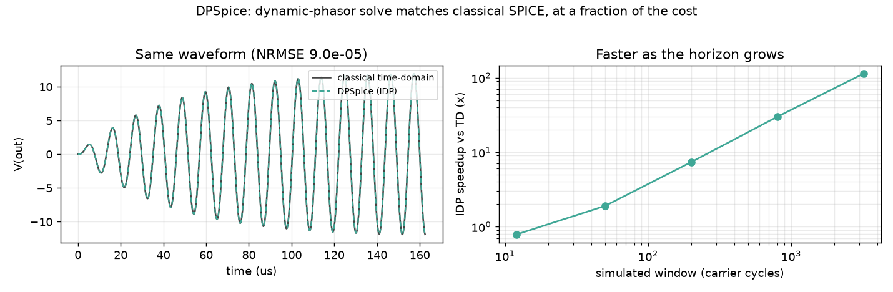

# DPSpice

[](https://doi.org/10.5281/zenodo.21085058)
[](LICENSE)
[](pyproject.toml)
[](https://github.com/doyun-gu/dpspice-ecce2026/actions/workflows/ci.yml)

**Topology-independent dynamic-phasor circuit simulation.** Drop in a SPICE
netlist, and DPSpice figures out the rest: it parses the circuit, stamps the
modified-nodal-analysis (MNA) system, picks the right solver, and runs it.
Netlist in, result out.

This is the reference implementation accompanying the ECCE 2026 paper by
Doyun Gu and Cheng Zhang (University of Manchester). The archived release is on
Zenodo: [`10.5281/zenodo.21085058`](https://doi.org/10.5281/zenodo.21085058).



*Series-RLC resonance: the dynamic-phasor (IDP) solve sits on top of the
classical time-domain waveform (NRMSE 9e-5), while the speedup over a full
time-domain solve grows with the simulated horizon. Both panels are real engine
output; absolute speedups are machine-dependent, the trend is not.*

## Quickstart

Install the CLI globally with [pipx](https://pipx.pypa.io) (no virtualenv to
manage), then run a bundled example:

```bash
# 1. Install the `dpspice` command + its CLI dependencies
pipx install "dpspice[cli] @ git+https://github.com/doyun-gu/dpspice-ecce2026.git"

# 2. Confirm it is on your PATH
dpspice --version          # -> 1.0.3

# 3. Inspect a circuit (what will it decide?) ...
dpspice info  examples/rlc.sp

# 4. ... then simulate it
dpspice run   examples/rlc.sp
```

`dpspice run` parses the netlist, announces every auto-decision, solves, and
prints a per-node summary:

```text
┌───────────────────────────────── dpspice run ──────────────────────────────────┐
│ Solver      IDP                                                                │
│ Reason      linear circuit, no nonlinear devices -> IDP single-shift transient │
│ Carrier     92300 Hz                                                           │
│ MNA states  5                                                                  │
│ Solve time  354.8 ms                                                           │
└────────────────────────────────────────────────────────────────────────────────┘
┏━━━━━━┳━━━━━━━━━━┳━━━━━━━━┳━━━━━━━━┓
┃ node ┃ final    ┃ peak   ┃ rms    ┃
┡━━━━━━╇━━━━━━━━━━╇━━━━━━━━╇━━━━━━━━┩
│ N001 │ 0.2487   │ 1      │ 0.7077 │
│ N002 │ 0.002278 │ 0.9604 │ 0.3719 │
│ N003 │ 11.29    │ 12.1   │ 7.159  │
└──────┴──────────┴────────┴────────┘
```

The bundled `examples/` netlists ship inside the package, so they resolve from
any working directory. Add `--out result.json` to save the full waveforms, or
`--json` for machine-readable output (see [Commands](#commands)). On a bare
`pipx install` (no `[cli]`), the `dpspice` command prints a one-line hint to add
the CLI extras; `import dpspice` works either way.

## Install (development)

To hack on the engine or run the test suite, install from a clone in editable
mode:

```bash
git clone https://github.com/doyun-gu/dpspice-ecce2026
cd dpspice-ecce2026
python -m venv .venv && source .venv/bin/activate
pip install -e .[cli]      # library + the `dpspice` command-line interface
```

Requires Python 3.10+. The **core** (`pip install -e .`) pulls only NumPy,
SciPy, and simpleeval, so embedding the solver via `import dpspice` stays
lightweight. User-facing layers are opt-in extras:

| Extra | Adds | For |
|---|---|---|
| `.[cli]` | typer, rich, pyfiglet | the `dpspice` command |
| `.[mcp]` | mcp | the `dpspice-mcp` server |
| `.[viz]` | matplotlib | the notebooks |
| `.[dev]` | pytest + all of the above | running the test suite |

Cross-validation uses **ngspice**, an external binary (macOS: `brew install
ngspice`). Tests that need it skip cleanly when it is absent.

## Determinism & testing

The solver is **deterministic**: the same netlist run repeatedly returns
bit-identical waveforms (no seeded RNG, no nondeterministic branch). The
paper's headline numbers are frozen as a versioned golden baseline and
re-checked on every run.

```bash
pip install -e .[dev]
pytest                  # golden regression + determinism + error catalogue
dpspice suite --quick   # real engine cross-validated against ngspice
```

See `CONTRIBUTING.md` for the determinism and golden-baseline contracts,
`REPRODUCIBILITY.md` for the paper-artifact-to-command map (and exactly what is
and isn't reproducible from this repo alone), and `PAPER_CODE_MISMATCHES.md` for
the honest, on-record list of places where a regenerated number differs from the
paper text — recorded as findings, never silently patched.

## Notebooks

Five worked examples live in [`notebooks/`](notebooks/), runnable after
`pip install dpspice[viz]`: quickstart, envelope-vs-classical speedup,
cross-validation against ngspice (with a bundled `.raw` fallback), the nonlinear
harmonic-balance path, and scaling. They ship with rendered outputs; see
[`notebooks/README.md`](notebooks/README.md) for the re-execute command.

## Netlist format

DPSpice reads a practical subset of SPICE. A netlist is a title line, element
and dot-command lines, and `.end`:

```spice
* Series RLC resonant circuit
V1 N001 0   SINE(0 1 92.3k)
R1 N001 N002 3.0
L1 N002 N003 100.04u
C1 N003 0    30.07n
R2 N003 0    2k
.tran 0 0.2m
.end
```

| Supported | Notes |
|---|---|
| `R`, `L`, `C` | passive elements; engineering suffixes (`k`, `u`, `n`, `p`, `m`, `meg`) |
| `V`, `I` sources | `DC`, `SINE(off ampl freq)`, `PULSE(...)`, `PWL(...)` |
| `K` | mutual inductive coupling (transformers, WPT links) |
| `D` | diode (`.model D(Is=... N=...)`); the **only** nonlinear device in v1 |
| `.tran`, `.ic`, `.param`, `.model`, `.options`, `.end`, `.backanno` | `.options` / `.backanno` are tolerated; `{expr}` parameter expressions are evaluated |

**Not yet supported** (these parse but the solver rejects them with a clear
message, rather than guessing): MOSFET `M` and BJT `Q` models, and subcircuit
expansion (`.subckt` / `X`). `.ac` is parsed but the engine targets transient
(`.tran`). Feed a netlist DPSpice can't handle and it raises a `DpspiceError`
that names the unsupported card — never a traceback.

## How it decides (three tiers)

DPSpice never asks you to hand-configure the solver, but it never silently
guesses either: it **decides, announces, and lets you override**.

* **Tier 1 — automatic.** Parse the netlist, build the MNA system, count
  states, read the `.tran` window. Deterministic from the netlist alone.
* **Tier 2 — auto-estimated, announced, overridable.**
  * *Analysis mode*: a circuit with a nonlinear device (a diode) solves with
    **harmonic balance (HB)**; a purely linear circuit solves with the
    **instantaneous dynamic phasor (IDP)** single-shift transient.
  * *Carrier frequency*: read from the `SINE` source. Multiple distinct
    frequencies trigger a warning and require `--omega`.
  * *Harmonic count K* (HB only): defaults to 20 and auto-raises toward the
    cap until the Newton solve converges.
* **Tier 3 — overrides.** `--mode {auto,td,idp,hb}`, `--harmonics K`,
  `--omega <Hz>`, `--tol`, `--out result.json`.

Run `dpspice info <netlist>` to see every decision *before* solving.

## Commands

| Command | What it does |
|---|---|
| `dpspice run <netlist>` | Auto-decide and simulate. `--out result.json` saves waveforms. |
| `dpspice info <netlist>` | Parse and report mode/omega/states/devices. No solve. |
| `dpspice validate <netlist> --ref <ltspice.raw>` | Cross-validate vs an LTspice `.raw`; reports NRMSE / R². |
| `dpspice bench` | Computational benchmark over the bundled examples. |
| `dpspice reproduce` | List reproducible paper artifacts; `--table N` / `--figure N` to regenerate one. |

Every command accepts `--json` for machine-readable output. The banner and
spinners auto-disable when stdout is not a TTY; `--quiet` / `--no-banner`
force calm output, and `--out` writes data only.

## Reproducing the paper

All numbers are regenerated from the real solver over the bundled examples —
nothing is hard-coded.

```bash
dpspice reproduce                 # list what can be reproduced here
dpspice reproduce --table 3       # computational benchmark
dpspice reproduce --table 4       # accuracy vs LTspice (rectifier)
dpspice reproduce --figure 5      # rectifier output waveform
dpspice validate examples/rectifier_halfwave.sp \
    --ref examples/rectifier_halfwave.raw
```

Artifacts that depend on reference data not redistributed here (the full RLC
Q-sweep, the WPT link, the IEEE-network timing tables) are listed by
`dpspice reproduce` with a note on what external data they need, rather than
shipping fabricated numbers. To validate against your own reference, point
`dpspice validate` at any LTspice `.raw`.

## MCP server

DPSpice ships an MCP server so an agent (Claude Code, Claude Desktop) can
simulate a pasted netlist. Tools: `dpspice_info`, `dpspice_run`,
`dpspice_waveforms`, `dpspice_validate`. Netlists are passed as **strings**;
results are plain JSON; no banners or spinners ever enter a tool result, and
all server logs go to stderr so the stdio channel stays clean.

Tool results stay **bounded**. `dpspice_run` returns scalar summaries plus a
compact descriptor per node and a `waveforms_handle` rather than inlining the
sample arrays; fetch the arrays on demand (decimated to a `max_points` cap)
with `dpspice_waveforms(handle, name=..., max_points=...)`.

Add to `claude_desktop_config.json`:

```json
{
  "mcpServers": {
    "dpspice": {
      "command": "dpspice-mcp"
    }
  }
}
```

If `dpspice-mcp` is not on the agent's `PATH`, use the venv's absolute path,
e.g. `"/path/to/dpspice-ecce2026/.venv/bin/dpspice-mcp"`.

## Roadmap

* **HTTP service layer — planned, not in this release.** The Python API is the
  single core every interface wraps, so a thin HTTP service (`/simulate` and
  friends) can sit on it without touching the engine. It is a design intent, not
  shipping code — there is no web server in this release, and no `[web]` extra.
* **Compiled backend — planned.** `dpspice.backend()` reports the active compute
  backend (`"python"` today). A pybind11/cffi backend can be added behind that
  call with no change to callers. The `[native]` marker is a placeholder; the
  pure-Python backend is the shipping path.

## License & patent note

Licensed under **Apache 2.0** (see `LICENSE`). Apache 2.0 is used
deliberately for its explicit patent grant: the instantaneous-dynamic-phasor
method has associated patent considerations, and the Apache grant gives users
a clear, express license to any patent claims practiced by this code.

## Citation

If you use DPSpice in academic work, please cite **both**: the paper for the
*method*, and the Zenodo DOI for the *archived software* you ran.

GitHub's "Cite this repository" button reads `CITATION.cff`. The BibTeX:

**Method (the paper):**

```bibtex
@inproceedings{gu2026dpspice,
  author    = {Gu, Doyun and Zhang, Cheng},
  title     = {{DPSpice}: Topology-Independent Dynamic Phasor Simulation via Modified Nodal Analysis},
  booktitle = {2026 IEEE Energy Conversion Congress and Exposition (ECCE)},
  address   = {Vancouver, Canada},
  publisher = {IEEE},
  year      = {2026}
  % IEEE DOI to be added at publication
}
```

**Software (this implementation):** cite the Zenodo *concept* DOI
[`10.5281/zenodo.21085058`](https://doi.org/10.5281/zenodo.21085058), which
always resolves to the latest archived version.

```bibtex
@software{gu2026dpspice_software,
  author    = {Gu, Doyun and Zhang, Cheng},
  title     = {{DPSpice}: Topology-Independent Dynamic-Phasor Circuit Simulation},
  publisher = {Zenodo},
  version   = {v1.0.3},
  doi       = {10.5281/zenodo.21085058},
  url       = {https://doi.org/10.5281/zenodo.21085058},
  year      = {2026}
}
```
