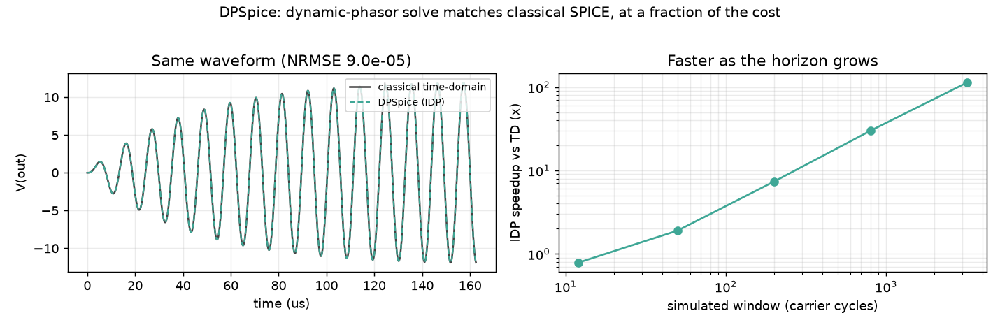

# DPSpice

[](https://doi.org/10.5281/zenodo.21085058)
[](LICENSE)
[](pyproject.toml)
[](https://github.com/doyun-gu/dpspice-ecce2026/actions/workflows/ci.yml)

**Topology-independent dynamic-phasor circuit simulation.** Drop in a SPICE
netlist, and DPSpice figures out the rest: it parses the circuit, stamps the
modified-nodal-analysis (MNA) system, picks the right solver, and runs it.
Netlist in, result out.

This is the reference implementation accompanying the ECCE 2026 paper by
Doyun Gu and Cheng Zhang (University of Manchester). The archived release is on
Zenodo: [`10.5281/zenodo.21085058`](https://doi.org/10.5281/zenodo.21085058).



*Series-RLC resonance: the dynamic-phasor (IDP) solve sits on top of the
classical time-domain waveform (NRMSE 9e-5), while the speedup over a full
time-domain solve grows with the simulated horizon. Both panels are real engine
output; absolute speedups are machine-dependent, the trend is not.*

## Quickstart

Install the CLI globally with [pipx](https://pipx.pypa.io) (no virtualenv to
manage), then run a bundled example:

```bash
# 1. Install the `dpspice` command + its CLI dependencies
pipx install "dpspice[cli] @ git+https://github.com/doyun-gu/dpspice-ecce2026.git"

# 2. Confirm it is on your PATH
dpspice --version          # -> 1.1.0

# 3. See what ships with the package ...
dpspice examples

# 4. ... inspect a circuit (what will it decide?) ...
dpspice info rlc.sp

# 5. ... then simulate it
dpspice run rlc.sp
```

For your own netlists the command name is optional — `dpspice run` is implied
when the first argument is a netlist file, so dragging a file into the
terminal after typing `dpspice ` is enough:

```bash
dpspice ~/Desktop/my_converter.sp
```

`dpspice run` parses the netlist, announces every auto-decision, solves, and
prints a per-node summary:

```text
┌───────────────────────────────── dpspice run ──────────────────────────────────┐
│ Solver      IDP                                                                │
│ Reason      linear circuit, no nonlinear devices -> IDP single-shift transient │
│ Carrier     92300 Hz                                                           │
│ MNA states  5                                                                  │
│ Solve time  354.8 ms                                                           │
└────────────────────────────────────────────────────────────────────────────────┘
┏━━━━━━┳━━━━━━━━━━┳━━━━━━━━┳━━━━━━━━┓
┃ node ┃ final    ┃ peak   ┃ rms    ┃
┡━━━━━━╇━━━━━━━━━━╇━━━━━━━━╇━━━━━━━━┩
│ N001 │ 0.2487   │ 1      │ 0.7077 │
│ N002 │ 0.002278 │ 0.9604 │ 0.3719 │
│ N003 │ 11.29    │ 12.1   │ 7.159  │
└──────┴──────────┴────────┴────────┘
```

The bundled example netlists ship inside the package, so they resolve from any
working directory — as the bare name (`rlc.sp`), the extensionless name
(`rlc`), or the `examples/rlc.sp` form. A local file of the same name always
wins; when the bundled copy is used the CLI says so on stderr. `dpspice
examples` lists them, `dpspice examples <name>` prints one, and
`dpspice examples <name> --copy` writes an editable copy to the current
directory. Add `--out result.json` to save the full waveforms, or
`--json` for machine-readable output (see [Commands](#commands)). On a bare
`pipx install` (no `[cli]`), the `dpspice` command prints a one-line hint to add
the CLI extras; `import dpspice` works either way.

## Install (development)

To hack on the engine or run the test suite, install from a clone in editable
mode:

```bash
git clone https://github.com/doyun-gu/dpspice-ecce2026
cd dpspice-ecce2026
python -m venv .venv && source .venv/bin/activate
pip install -e ".[cli]"    # library + the `dpspice` command-line interface
```

Requires Python 3.10+. The **core** (`pip install -e .`) pulls only NumPy,
SciPy, and simpleeval, so embedding the solver via `import dpspice` stays
lightweight. User-facing layers are opt-in extras:

| Extra | Adds | For |
|---|---|---|
| `.[cli]` | typer, rich, pyfiglet | the `dpspice` command |
| `.[mcp]` | mcp | the `dpspice-mcp` server |
| `.[viz]` | matplotlib | the notebooks |
| `.[dev]` | pytest + all of the above | running the test suite |

Cross-validation uses **ngspice**, an external binary (macOS: `brew install
ngspice`). Tests that need it skip cleanly when it is absent.

## Determinism & testing

The solver is **deterministic**: the same netlist run repeatedly returns
bit-identical waveforms (no seeded RNG, no nondeterministic branch). The
paper's headline numbers are frozen as a versioned golden baseline and
re-checked on every run.

```bash
pip install -e ".[dev]"
pytest                  # golden regression + determinism + error catalogue
dpspice suite --quick   # real engine cross-validated against ngspice
```

See `CONTRIBUTING.md` for the determinism and golden-baseline contracts,
`REPRODUCIBILITY.md` for the paper-artifact-to-command map (and exactly what is
and isn't reproducible from this repo alone), and `PAPER_CODE_MISMATCHES.md` for
the honest, on-record list of places where a regenerated number differs from the
paper text — recorded as findings, never silently patched.

## Notebooks

Five worked examples live in [`notebooks/`](notebooks/), runnable after
`pip install "dpspice[viz]"`: quickstart, envelope-vs-classical speedup,
cross-validation against ngspice (with a bundled `.raw` fallback), the nonlinear
harmonic-balance path, and scaling. They ship with rendered outputs; see
[`notebooks/README.md`](notebooks/README.md) for the re-execute command.

## Netlist format

DPSpice reads a practical subset of SPICE. A netlist is a title line, element
and dot-command lines, and `.end`:

```spice
* Series RLC resonant circuit
V1 N001 0   SINE(0 1 92.3k)
R1 N001 N002 3.0
L1 N002 N003 100.04u
C1 N003 0    30.07n
R2 N003 0    2k
.tran 0 0.2m
.end
```

| Supported | Notes |
|---|---|
| `R`, `L`, `C` | passive elements; engineering suffixes (`k`, `u`, `n`, `p`, `m`, `meg`) |
| `V`, `I` sources | `DC`, `SINE(off ampl freq)`, `PULSE(...)`, `PWL(...)` |
| `K` | mutual inductive coupling (transformers, WPT links) |
| `D` | diode (`.model D(Is=... N=...)`); the **only** nonlinear device in v1 |
| `S` | gate-driven switch `Sxxx n+ n- nc+ nc- MODEL` with `.model SW(Ron=... Roff=... Vt=... [Vh=...])`; the gate must trace to an independent `PULSE` source (see *Switched circuits*) |
| `.tran`, `.ic`, `.param`, `.model`, `.options`, `.end`, `.backanno` | `.options` / `.backanno` are tolerated; `{expr}` parameter expressions are evaluated |

**Not yet supported** (these parse but the solver rejects them with a clear
message, rather than guessing): MOSFET `M` and BJT `Q` models, and subcircuit
expansion (`.subckt` / `X`). `.ac` is parsed but the engine targets transient
(`.tran`). Feed a netlist DPSpice can't handle and it raises a `DpspiceError`
that names the unsupported card — never a traceback.

## How it decides (three tiers)

DPSpice never asks you to hand-configure the solver, but it never silently
guesses either: it **decides, announces, and lets you override**.

* **Tier 1 — automatic.** Parse the netlist, build the MNA system, count
  states, read the `.tran` window. Deterministic from the netlist alone.
* **Tier 2 — auto-estimated, announced, overridable.**
  * *Analysis mode*: a circuit with a nonlinear device (a diode) solves with
    **harmonic balance (HB)**; a purely linear circuit solves with the
    **instantaneous dynamic phasor (IDP)** single-shift transient.
  * *Carrier frequency*: read from the `SINE` source. Multiple distinct
    frequencies trigger a warning and require `--omega`.
  * *Harmonic count K* (HB only): defaults to 20 and auto-raises toward the
    cap until the Newton solve converges.
* **Tier 3 — overrides.** `--mode {auto,td,idp,hb}`, `--harmonics K`,
  `--omega <Hz>`, `--tol`, `--out result.json`.

Run `dpspice info <netlist>` to see every decision *before* solving.

## Switched circuits

Netlists containing gate-driven switches (`S` elements) route through a
switched-linear pipeline instead of the transient solvers. The router
classifies every element and prints its decision:

```bash
dpspice route examples/buck_sync.sp          # routing table, no solve
dpspice run examples/buck_sync.sp --analysis hb --K 7        # LTP steady state
dpspice run examples/buck_sync.sp --analysis envelope --K 5 \
    --horizon 2m --dt 2u                     # envelope-bank transient
```

**Routing rule.** A switch is LTP-routable when its controlling pair traces
to an independent `PULSE` source that is not part of the power path, so the
gate waveform is known a priori as a `(duty, f_sw, phase)` triple. Inverted
gate trains fold to the complement duty and shifted phase automatically.
State-dependent gates (the controlling pair sits in the power path) and
non-`PULSE` gates are refused with an error naming the element and the
reason; those circuits belong on the Newton or transient path. `dpspice
route` exits nonzero when any element is refused.

**Three analysis paths**, chosen by what the router finds:

* **LTP harmonic balance** (`--analysis hb`, gated switches only). Each
  switch becomes a constant Toeplitz block in the harmonic-balance operator,
  so the periodic steady state is a *single linear solve* — no Newton
  iteration, no time stepping. Per-harmonic tables are printed alongside the
  usual waveform summary.
* **Envelope bank** (`--analysis envelope`, gated switches only). The same
  constant coupling matrices drive a fixed-step trapezoidal integration of
  the harmonic envelopes, capturing the start-up transient. `--horizon`
  defaults to the `.tran` window; `|X0|` and `|X1|` envelopes are exported
  with the waveforms.
* **Hybrid NR-HB** (`--analysis hb`, switches plus diodes) — **experimental**.
  Switch blocks are assembled once outside the Newton loop; only the diode
  blocks are refreshed per iteration. The result matches the unmodified
  Newton solver to solver precision (asserted in the test suite), but the
  path has been validated on a narrower circuit population than the LTP and
  envelope paths — see the limitations below and `VALIDATION_REPORT.md`.

The bundled examples cover all three paths: `buck_sync.sp`, `boost_sync.sp`,
`buckboost_sync.sp` and `src_bridge.sp` (LTP and envelope), `boost_async.sp`,
`boost_async_snubber.sp` and `hybrid_mix.sp` (hybrid). The Python API mirrors the CLI: `dpspice.route(netlist)`,
`dpspice.solve_hb(netlist, K=7)`, `dpspice.solve_envelope(netlist, K=5,
horizon="2m")`.

**Limitations.** The LTP formulation assumes continuous conduction (CCM):
the switch conductance pattern must equal the gate pattern. Dead-time
intervals, discontinuous conduction (DCM) and state-dependent commutation
fall outside its validity — use the Newton (`hb` with diode formulations) or
transient path for those. A diode converter driven to light load enters DCM;
the hybrid path will either track the new operating point or fail to converge
loudly, but the averaged interpretation no longer holds there.

*DC truncation bias at stiff switched nodes.* Whenever a switch commutates
against a node held stiff between edges (a capacitor-clamped output, as in the
boost and inverting buck-boost sync-switch), the DC component of that node
converges only as O(1/K): the truncated switching function rings (Gibbs) across
the clamped off-state voltage. The error is duty-dependent. At moderate duty it
sits inside the ripple band at the default harmonic count (the synchronous boost
at d = 0.6 is inside its ripple band by K = 20), but at high duty (d ≳ 0.7 on
the boost and buck-boost) the k = 0 error *exceeds* the ripple band and only
closes as K grows (Richardson extrapolation recovers the ideal V_in/(1−d) less
the conduction drop). Quote accuracy at the filtered node of interest, not at
the switched node, and raise K when the k = 0 value matters. This is a general
property of the LTP path at stiff switched nodes, not specific to one example;
switches that feed an inductor (the buck sync switch) do not carry it.
Two opt-in mitigations ship for the LTP path: `--bias-correction` applies a
closed-form, parameter-free correction of the O(1/K) gate-tail defect
(derivation and validation in `validation/bias_closed_form.md`; structural
zero on the buck, results labelled `ltp+bias`), and `--richardson` solves at
K and 2K and extrapolates the shared harmonics (results labelled
`ltp+richardson`, both solve times reported). They correct the same defect
and are mutually exclusive.

*The bias correction is contractive only in a bounded regime.* The closed-form
correction is applied as a fixed-point iteration, and its iteration matrix
scales with the switch conductance swing times the gate tail times the
circuit's response to the k = 0 defect. A stiff switched node at high duty —
a low R·C_out·f_sw output around d ≳ 0.7 — can put the spectral radius above
one at any practical K, and the iteration then *diverges* rather than
degrades. This is a general property of the fixed point, not of one circuit.
Non-convergence is always reported: `converged=False` on the result object,
and the CLI/dispatch layer raises a typed error instead of printing a
corrected value — a non-converged correction must never be used. In that
regime `--richardson` (which corrects the same defect without a fixed point)
and raising K on the plain path remain available; a per-interval exact
analysis covering it exists as an exploration prototype
(`exploration/basis-selection/`) and is not part of the package.

*Hard diode commutation is convergence-fragile.* When a diode commutates on a
hard-switched node, the truncated switch node chatters across the junction
threshold and the plain hybrid Newton residual does not decrease monotonically
with K: a given circuit may converge at one harmonic count and stall at a
neighbouring one. When that happens the solver automatically engages Newton
continuation — geometric source stepping from 10% amplitude with adaptive
step-back, then SPICE-style Gmin stepping — and records the rungs it took in
the run record; cases plain Newton already solves are unaffected. With the
continuation, `boost_async.sp` (the bare converter) and
`boost_async_snubber.sp` (a 150 nF snubber that deliberately shifts the
operating point upward) both converge across K = 10…40, and the bare DC
approaches the transient reference 29.315 V first-order in K from above.
Total non-convergence is still reported as a loud error, never a silent wrong
answer, and a hybrid DC at moderate K still carries finite-K bias: validate
any hybrid diode operating point against a transient reference.

## Commands

| Command | What it does |
|---|---|
| `dpspice run <netlist>` | Auto-decide and simulate. `--out result.json` saves waveforms. |
| `dpspice route <netlist>` | Classify every element of a switched netlist (no solve). Nonzero exit if any element is refused. |
| `dpspice info <netlist>` | Parse and report mode/omega/states/devices. No solve. |
| `dpspice validate <netlist> --ref <ltspice.raw>` | Cross-validate vs an LTspice `.raw`; reports NRMSE / R². |
| `dpspice bench` | Computational benchmark over the bundled examples. |
| `dpspice reproduce` | List reproducible paper artifacts; `--table N` / `--figure N` to regenerate one. |
| `dpspice suite` | Auto-generate circuit families and score each against an independent oracle (`--full` for the whole sweep). |
| `dpspice examples [name] [--copy]` | List the bundled example netlists, print one, or copy one out to edit. |

Every command accepts `--json` for machine-readable output. The banner and
spinners auto-disable when stdout is not a TTY; `--quiet` / `--no-banner`
force calm output, and `--out` writes data only.

`dpspice <netlist>` with no command runs it (`run` is implied for a
path-shaped first argument), and any `<netlist>` argument that is not a file
on disk falls back to the bundled examples by name.

## Reproducing the paper

All numbers are regenerated from the real solver over the bundled examples —
nothing is hard-coded.

```bash
dpspice reproduce                 # list what can be reproduced here
dpspice reproduce --table 3       # computational benchmark (Table III)
dpspice reproduce --table 5       # accuracy vs LTspice (rectifier, Table V)
dpspice reproduce --figure 6      # rectifier output waveform (Fig. 6)
dpspice validate examples/rectifier_halfwave.sp \
    --ref examples/rectifier_halfwave.raw
```

Artifacts that depend on reference data not redistributed here (the full RLC
Q-sweep, the WPT link, the IEEE-network timing tables) are listed by
`dpspice reproduce` with a note on what external data they need, rather than
shipping fabricated numbers. To validate against your own reference, point
`dpspice validate` at any LTspice `.raw`.

## MCP server

DPSpice ships an MCP server so an agent (Claude Code, Claude Desktop) can
simulate a pasted netlist. Tools: `dpspice_info`, `dpspice_run`,
`dpspice_waveforms`, `dpspice_validate`. Netlists are passed as **strings**;
results are plain JSON; no banners or spinners ever enter a tool result, and
all server logs go to stderr so the stdio channel stays clean.

Tool results stay **bounded**. `dpspice_run` returns scalar summaries plus a
compact descriptor per node and a `waveforms_handle` rather than inlining the
sample arrays; fetch the arrays on demand (decimated to a `max_points` cap)
with `dpspice_waveforms(handle, name=..., max_points=...)`.

Add to `claude_desktop_config.json`:

```json
{
  "mcpServers": {
    "dpspice": {
      "command": "dpspice-mcp"
    }
  }
}
```

If `dpspice-mcp` is not on the agent's `PATH`, use the venv's absolute path,
e.g. `"/path/to/dpspice-ecce2026/.venv/bin/dpspice-mcp"`.

## Roadmap

* **HTTP service layer — planned, not in this release.** The Python API is the
  single core every interface wraps, so a thin HTTP service (`/simulate` and
  friends) can sit on it without touching the engine. It is a design intent, not
  shipping code — there is no web server in this release, and no `[web]` extra.
* **Compiled backend — planned.** `dpspice.backend()` reports the active compute
  backend (`"python"` today). A pybind11/cffi backend can be added behind that
  call with no change to callers. The `[native]` marker is a placeholder; the
  pure-Python backend is the shipping path.

## License & patent note

Licensed under **Apache 2.0** (see `LICENSE`). Apache 2.0 is used
deliberately for its explicit patent grant: the instantaneous-dynamic-phasor
method has associated patent considerations, and the Apache grant gives users
a clear, express license to any patent claims practiced by this code.

## Citation

If you use DPSpice in academic work, please cite **both**: the paper for the
*method*, and the Zenodo DOI for the *archived software* you ran.

GitHub's "Cite this repository" button reads `CITATION.cff`. The BibTeX:

**Method (the paper):**

```bibtex
@inproceedings{gu2026dpspice,
  author    = {Gu, Doyun and Zhang, Cheng},
  title     = {{DPSpice}: Topology-Independent Dynamic Phasor Simulation via Modified Nodal Analysis},
  booktitle = {2026 IEEE Energy Conversion Congress and Exposition (ECCE)},
  address   = {Vancouver, Canada},
  publisher = {IEEE},
  year      = {2026}
  % IEEE DOI to be added at publication
}
```

**Software (this implementation):** cite the Zenodo *concept* DOI
[`10.5281/zenodo.21085058`](https://doi.org/10.5281/zenodo.21085058), which
always resolves to the latest archived version.

```bibtex
@software{gu2026dpspice_software,
  author    = {Gu, Doyun and Zhang, Cheng},
  title     = {{DPSpice}: Topology-Independent Dynamic-Phasor Circuit Simulation},
  publisher = {Zenodo},
  version   = {v1.1.0},
  doi       = {10.5281/zenodo.21085058},
  url       = {https://doi.org/10.5281/zenodo.21085058},
  year      = {2026}
}
```

The switched-linear extension (gated switches, LTP/envelope/hybrid paths) is
not covered by the ECCE paper above: a paper on it is in preparation. Until
it is published, cite the software DOI for that functionality.
